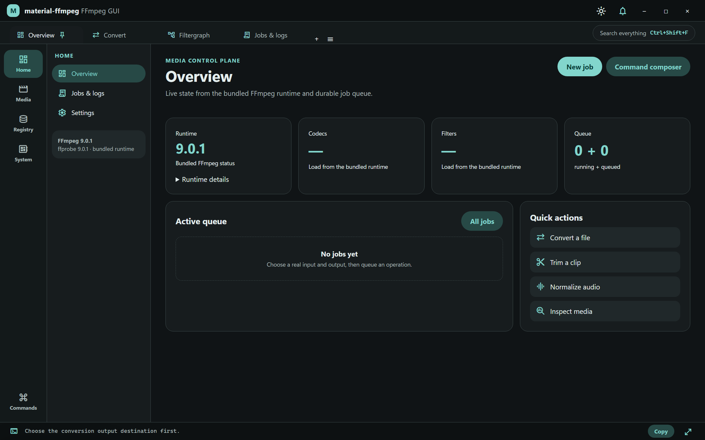
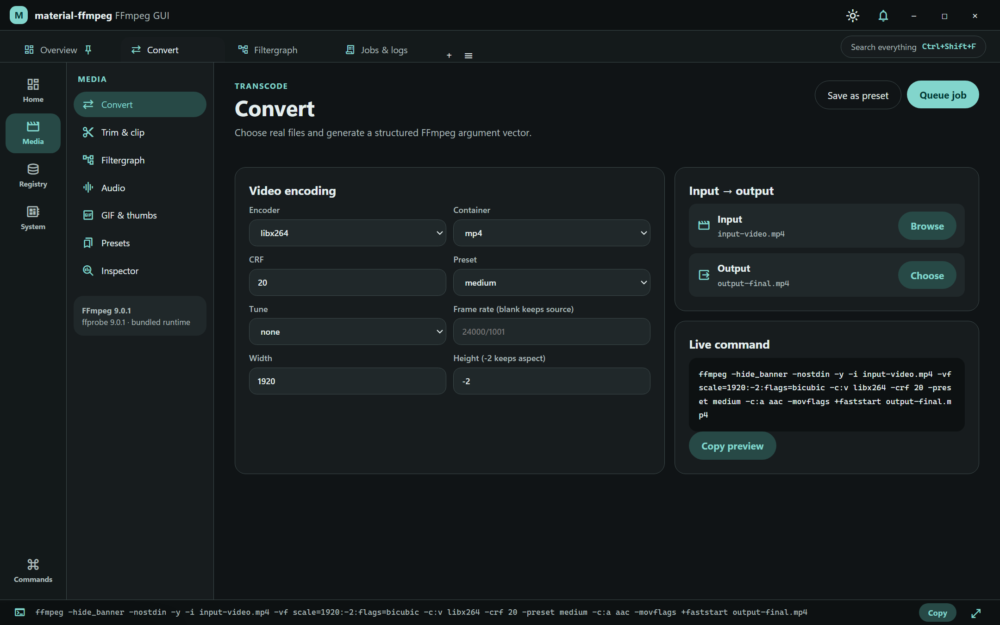
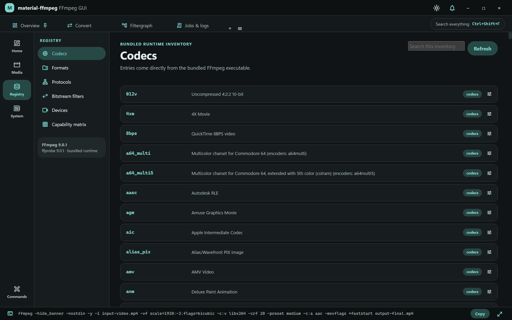

# material-ffmpeg

material-ffmpeg is a local Windows desktop interface for FFmpeg. It turns conversion, trimming, filtering, audio, GIF, thumbnail, streaming, inspection, and batch workflows into guided controls while keeping the exact FFmpeg command visible.

- [Project site](https://ding-ding-projects.github.io/material-ffmpeg/)
- [Releases](https://github.com/Ding-Ding-Projects/material-ffmpeg/releases)
- [Source](https://github.com/Ding-Ding-Projects/material-ffmpeg)

The supplied design is preserved under `design/source/`. Official FFmpeg source is pinned under `third_party/ffmpeg`; installed builds use a separately downloaded, checksum-verified FFmpeg 9.0.1 runtime.

## Build on Windows

```bat
download-dependencies.bat /s
build.bat /s
build-installer.bat /s
```

The scripts accept `/s`, `--silent`, or `SILENT=1`. They obtain the pinned Node.js toolchain, restore the exact npm lockfile, verify the FFmpeg archive SHA-256, generate the application icon, and build through the same unsigned Squirrel.Windows path used by automation.

`build.bat` produces a runnable unpacked application and optionally launches it. `build-installer.bat` produces and validates the setup executable, `RELEASES`, full `.nupkg`, bundled FFmpeg/FFprobe, upstream license evidence, source commit metadata, and SHA-256 values.

> **Unsigned software:** code signing is intentionally disabled. Windows may display an unknown-publisher or SmartScreen warning.

## Runtime and privacy

Media processing runs locally. The renderer cannot select an arbitrary executable or spawn a shell; the privileged process owns trusted FFmpeg resolution, job lifecycle, and bounded output delivery.

The runtime is pinned in `dependencies.json`. Generated dependencies, bundled binaries, caches, and build output are not committed.

## Real packaged captures

These images are byte-for-byte copies of captures from the packaged application at source commit `5358582f13b6af418e58c1971747b270d308f34b`. The application ran on a named off-screen desktop through `lowlevel-computer-use-cheap`; the visible desktop was untouched. Each image was decoded, inspected for the stated UI state, and reviewed for sensitive or unrelated content before promotion.

<details>
<summary>Overview and bundled runtime status</summary>



</details>

<details>
<summary>Conversion prepared with real files</summary>



</details>

<details>
<summary>Live codecs catalog</summary>



</details>

The real completed-conversion and Inspector interactions are recorded in a [path-redacted interaction receipt](docs/verification/receipts/5358582/interaction-summary.json). Their raw captures are not published because the rendered interface exposed machine-local paths. The [verification inventory](docs/verification/capture-manifest.json) records those capture gaps alongside the three promoted images, their exact hashes, and the limits of what each item proves.

## Release automation

Every push and manual dispatch builds one uniquely tagged, non-draft release and deploys `docs/` to GitHub Pages. The workflow builds and packages only; it intentionally runs no tests, lint, type checking, static analysis, accessibility checks, or screenshots.

The direct run [32460503357](https://github.com/Ding-Ding-Projects/material-ffmpeg/actions/runs/32460503357) completed successfully for exact commit `5358582f13b6af418e58c1971747b270d308f34b` and published the non-draft, non-prerelease [v0.1.22-r1 release](https://github.com/Ding-Ding-Projects/material-ffmpeg/releases/tag/v0.1.22-r1). The release contains the setup executable, `RELEASES`, full `.nupkg`, and `SHA256SUMS.txt`. Its current asset list does not include the separately required dim-sum image, so the broader release contract is not yet complete.

The committed line counter is reproducible with `npm run count:lines`.

## Licensing

The application source is MIT licensed. FFmpeg is a separate GPLv3 project distributed under its own terms. See `THIRD_PARTY_NOTICES.md` and the upstream license/build-information files packaged beside the runtime.

<details>
<summary>Repository layout</summary>

- `src/` — application and trusted runtime boundary
- `resources/` — icon source and generated runtime destination
- `scripts/` — dependency, build, package, verification, and line-count tooling
- `docs/` — responsive GitHub Pages site
- `design/source/` — supplied design archive contents
- `third_party/ffmpeg` — pinned official source reference

</details>
